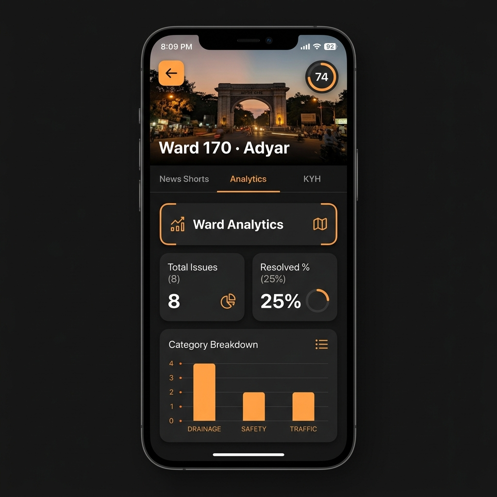
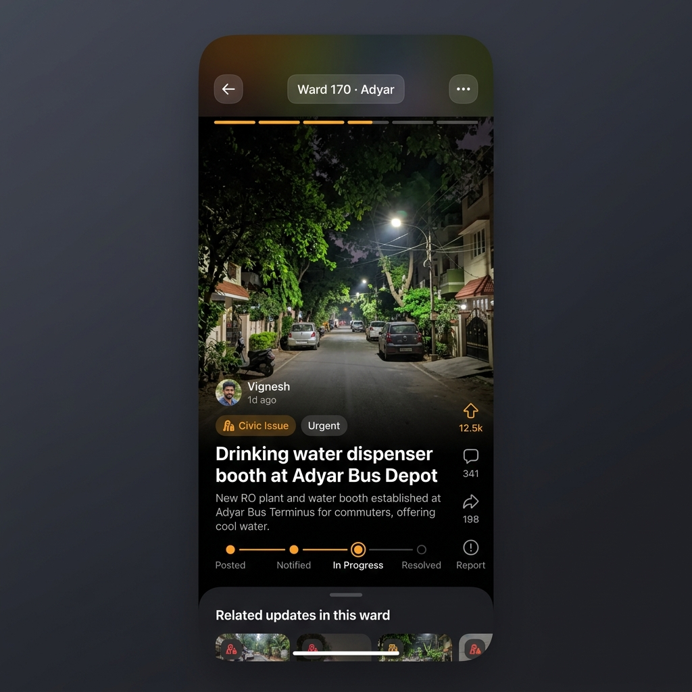
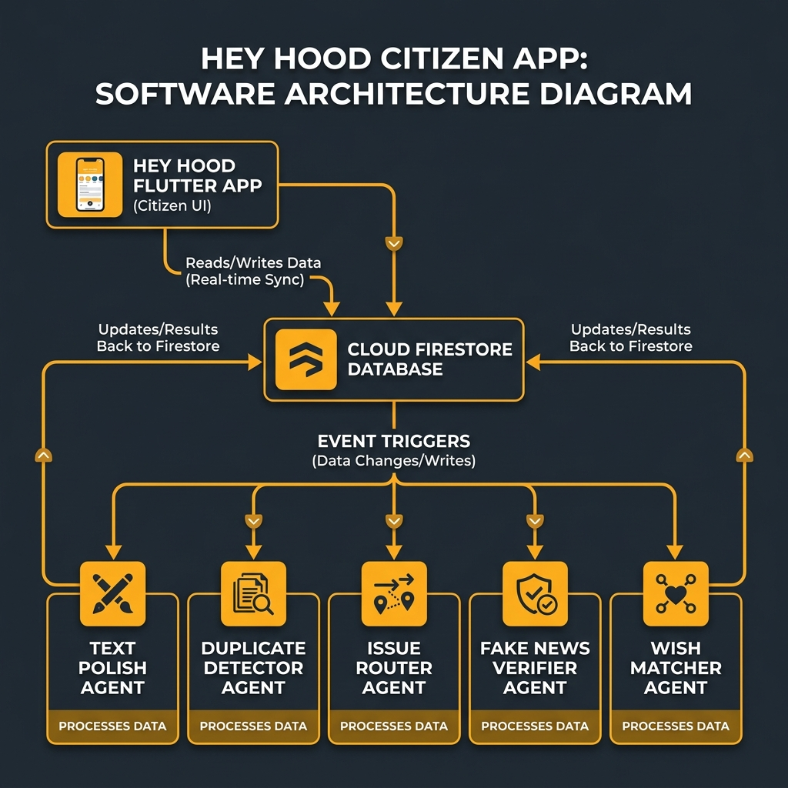

# 🗺️ Hey Hood — Civic Engagement & Smart Governance Platform
### Bridging the gap in civic accountability and addressing real governance challenges across local municipal wards in Tamil Nadu.

<p align="center">
  
  
  
  
</p>

---

## 🌟 Overview
**Hey Hood** is a next-generation local governance and citizen empowerment platform. It bridges the gap between local residents and ward officials using real-time Firestore synchronization and a fleet of autonomous **AI Agents** that handle moderation, duplicate detection, category routing, wish fulfillment, and automated escalations.

---

## 🛠️ Tech Stack & Architecture
* **Frontend Apps:** Flutter (separate apps for Citizen and Official interfaces).
* **Cloud Database:** Cloud Firestore (configured with permissive security rules for demo showcases).
* **Data Seeding & Migration:** Node.js script generating mock wards, geo-boundaries, and active users.
* **AI Agent Microservices:** Python-based LLM agents hosted on Vercel and Railway, automating civic task routing.
* **Geo-Boundary Detection:** GeoJSON ward boundaries mapped to coordinate datasets for citizen location resolution.

---

## 📸 Screenshots & Visual Assets

<p align="center">
  
  &nbsp;&nbsp;&nbsp;&nbsp;&nbsp;&nbsp;&nbsp;&nbsp;
  
</p>

### 🎨 Custom AI-Generated Illustrations
<p align="center">
  
  
  
</p>

---

## 📱 Download the Apps (Release APKs)
Ready-to-use binaries are included directly in the root of this repository:

* 👤 **[hey_hood.apk](file:///D:/Vibe%20Coding/hey_hood.apk)** (58.1 MB) — **Citizen Platform:** Report issues, post neighborhood wishes, view emergency contacts, check local notices, and view AI-generated visual previews of community suggestions.
* 👮 **[hood_officials.apk](file:///D:/Vibe%20Coding/hood_officials.apk)** (54.2 MB) — **Officials Dashboard:** View incoming issues, manage status updates (In Progress, Resolved), publish official ward notices, and track ward satisfaction metrics.

---

## 🤖 AI Agents & Cloud Ecosystem
The platform utilizes a microservice architecture of specialized, hosted AI agents running in the cloud:

| Agent Name | Purpose | Cloud Endpoint |
| :--- | :--- | :--- |
| ✨ **Text Polish Agent** | Cleans up and structures raw citizen inputs. | `https://hey-hood-agent-text-polish-5n2p.vercel.app` |
| 🔍 **Duplicate Detector** | Identifies similar active civic complaints to prevent duplication. | `https://hey-hood-agent-duplicate-detection.vercel.app` |
| 🔀 **Issue Router** | Categorizes and assigns issues to appropriate ward officials. | `https://hey-hood-agent-issue-routing.vercel.app` |
| 🚨 **Escalation Agent** | Automatically escalates unresolved complaints if deadlines pass. | `https://hey-hood-agent-escalation.vercel.app` |
| 🛑 **Fake News Verifier** | Moderates reports with mismatched text/images. | `https://hey-hood-agent-fake-news.vercel.app` |
| 🎯 **Wish Matcher** | Correlates citizen community wishes with ward budgets. | `https://hey-hood-agent-wish-matching.vercel.app` |

---

## 🛠️ Project Structure

```text
hey-hood/
├── agents/                           # Local Python LLM agent microservices
│   ├── duplicate_detection/          # Agent that identifies matching/similar citizen complaints
│   ├── escalation/                   # Agent that visualizes escalated overdue issues
│   ├── fake_news/                    # Agent that moderates report context issues
│   ├── issue_routing/                # Agent that automatically routes issues to the right department
│   ├── shared/                       # Shared utility functions and database connections for agents
│   ├── text_polish/                  # Agent that edits and polishes citizen descriptions
│   └── wish_matching/                # Agent that aligns citizen wishes with ward facilities
├── backend/                          # Firebase Backend deployment configuration
│   ├── functions/                    # Cloud functions and database seeding scripts
│   ├── .firebaserc                   # Firebase project active target configuration
│   ├── firebase.json                 # Firebase deployment configurations and rewrites
│   └── firestore.rules               # Security rules configuration for Firestore database
├── Database/                         # Master database setup, schemas, and seeding resources
│   ├── geo_data/                     # Chennai and Virudhunagar ward boundary coordinates
│   ├── seed_data/                    # Initial mocks for users, issues, wishes, and notices
│   ├── seed_scripts/                 # Automated seeding script for Firestore setup
│   ├── dummy_credentials.json        # Placeholder Firebase service credentials for local tests
│   └── firestore.rules               # Copy of current active database security rules
├── hey_hood/                         # Citizen App Flutter codebase
│   ├── android/                      # Native Android build configurations and platform setup
│   ├── assets/                       # Custom logos, icons, and static graphics
│   ├── lib/                          # Main Flutter application logic, screens, and models
│   └── pubspec.yaml                  # Citizen app package and asset dependencies
├── hood_officials/                   # Officials App Flutter codebase
│   ├── android/                      # Native Android build configurations and platform setup
│   ├── assets/                       # Custom logos, icons, and static graphics
│   ├── lib/                          # Main Flutter application logic, screens, and models
│   └── pubspec.yaml                  # Officials app package and asset dependencies
├── screenshots/                      # UI preview captures and custom visuals for documentation
├── .gitignore                        # Git ignore patterns for build folders and secrets
├── hey_hood.apk                      # Ready-to-install Android release build for citizens
├── hood_officials.apk                # Ready-to-install Android release build for officials
└── README.md                         # Project documentation and ecosystem architecture details
```

---

## 📋 Prerequisites
To set up and run this project locally, ensure you have the following installed and configured:
* **Flutter SDK:** Version `3.19.0` or higher (configured for Chrome web or Android devices).
* **Node.js:** Version `18.x` or higher (for database seeding scripts).
* **Firebase CLI:** Installed and authenticated on your local machine.
* **Firebase Account & Project:** An active Firebase project with **Cloud Firestore** database instance enabled.
* **Vercel Account:** Required to deploy and host the Python-based AI agent endpoints.

---

## ⚙️ Quick Start Guide

### 1. Clone the Repository
```bash
git clone https://github.com/phoenix-2211/heyhood-app.git
cd heyhood-app
```

### 2. Configure Firebase and Login
Make sure Firebase CLI is logged in and select your default active project:
```bash
firebase login
cd backend
firebase use --add
```

### 3. Seed the Database
Navigate to the backend functions folder and seed the mock ward data, users, and issues:
```bash
cd functions
node seed_demo_data.js
cd ../..
```

### 4. Running the Citizen App (Hey Hood)
```bash
cd hey_hood
flutter run -d chrome  # Or run on connected Android/iOS device
```

### 5. Running the Officials App (Hood Officials)
```bash
cd ../hood_officials
flutter run -d chrome  # Or run on connected Android/iOS device
```

---

## 🎨 System Architecture

<p align="center">
  
</p>

---

## 🏆 Acknowledgments
Built by **Sarvesh Santhosh** as a solo developer for the **Kaggle AI Agents Intensive Vibe Coding Capstone (Agents for Good track)**.

---
<p align="center">Made with ❤️ for smart, transparent, and responsive local governance.</p>
