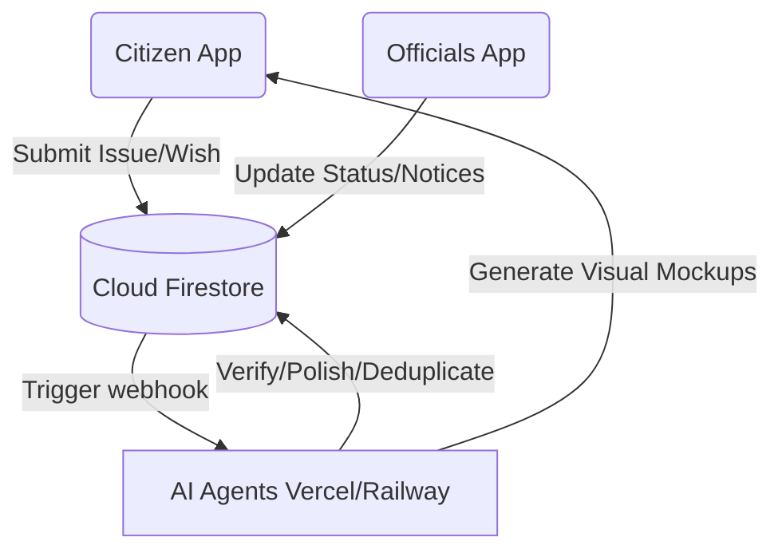

# 🗺️ Hey Hood — Civic Engagement & Smart Governance Platform

<p align="center">
  
  
  
  
</p>

---

## 🌟 Overview
**Hey Hood** is a next-generation local governance and citizen empowerment platform. It bridges the gap between local residents and ward officials using real-time Firestore synchronization and a fleet of autonomous **AI Agents** that handle moderation, duplicate detection, category routing, wish fulfillment, and automated escalations.

---

## 📱 Download the Apps (Release APKs)
Ready-to-use binaries are included directly in the root of this repository:

* 👤 **[hey_hood.apk](file:///D:/Vibe%20Coding/hey_hood.apk)** (58.1 MB) — **Citizen Platform:** Report issues, post neighborhood wishes, view emergency contacts, check local notices, and view AI-generated visual previews of community suggestions.
* 👮 **[hood_officials.apk](file:///D:/Vibe%20Coding/hood_officials.apk)** (54.2 MB) — **Officials Dashboard:** View incoming issues, manage status updates (In Progress, Resolved), publish official ward notices, and track ward satisfaction metrics.

---

## 🤖 AI Agents & Cloud Ecosystem
The platform utilizes a microservice architecture of specialized, hosted AI agents running in the cloud:

| Agent Name | Purpose | Cloud Endpoint |
| :--- | :--- | :--- |
| ✨ **Text Polish Agent** | Cleans up and structures raw citizen inputs. | `https://hey-hood-agent-text-polish-5n2p.vercel.app` |
| 🔍 **Duplicate Detector** | Identifies similar active civic complaints to prevent duplication. | `https://hey-hood-agent-duplicate-detection.vercel.app` |
| 🔀 **Issue Router** | Categorizes and assigns issues to appropriate ward officials. | `https://hey-hood-agent-issue-routing.vercel.app` |
| 🚨 **Escalation Agent** | Automatically escalates unresolved complaints if deadlines pass. | `https://hey-hood-agent-escalation.vercel.app` |
| 🛑 **Fake News Verifier** | Moderates reports with mismatched text/images. | `https://hey-hood-agent-fake-news.vercel.app` |
| 🎯 **Wish Matcher** | Correlates citizen community wishes with ward budgets. | `https://hey-hood-agent-wish-matching.vercel.app` |

---

## 🛠️ Project Structure
```directory
├── hey_hood/                # Flutter App for Citizens (Issues, Wishes, Alerts)
├── hood_officials/          # Flutter App for Ward Officials (Dashboard, Notices)
├── backend/                 # Cloud functions & DB seeding scripts
├── Database/                # Permissive security rules & geo-boundaries
├── hey_hood.apk             # Android Release APK (Citizen App)
└── hood_officials.apk       # Android Release APK (Officials App)
```

---

## ⚙️ Quick Start Guide

### Running Citizen App
```bash
cd hey_hood
flutter run -d chrome  # Or run on connected Android/iOS device
```

### Running Officials App
```bash
cd hood_officials
flutter run -d chrome  # Or run on connected Android/iOS device
```

### Seeding Firestore Data
```bash
cd backend/functions
node seed_demo_data.js
```

---

## 🎨 System Architecture



---
<p align="center">Made with ❤️ for smart, transparent, and responsive local governance.</p>
